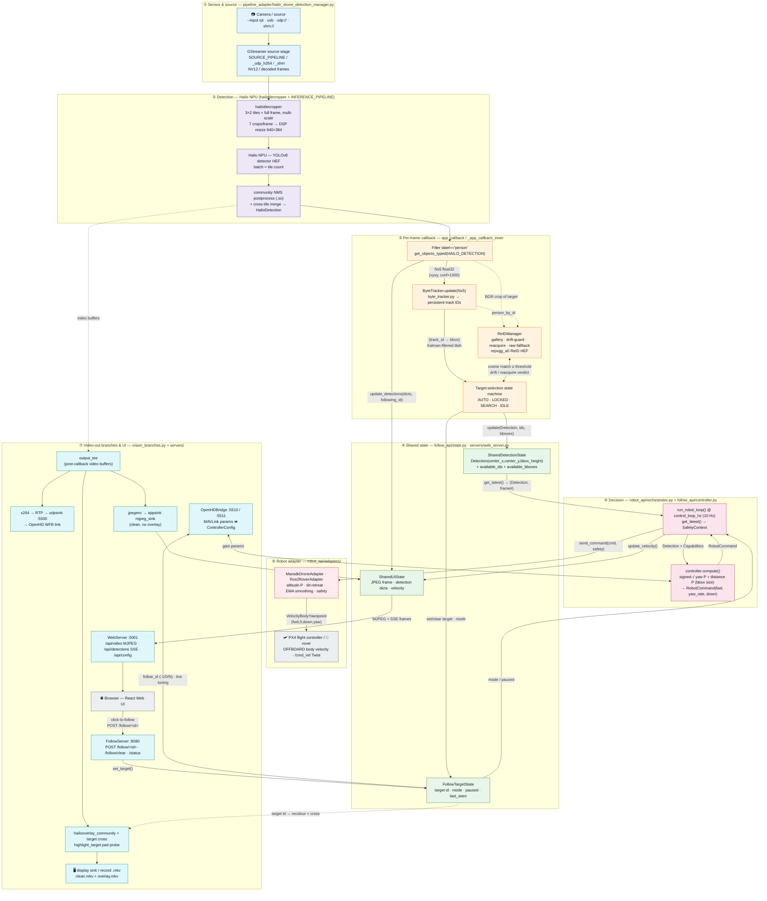
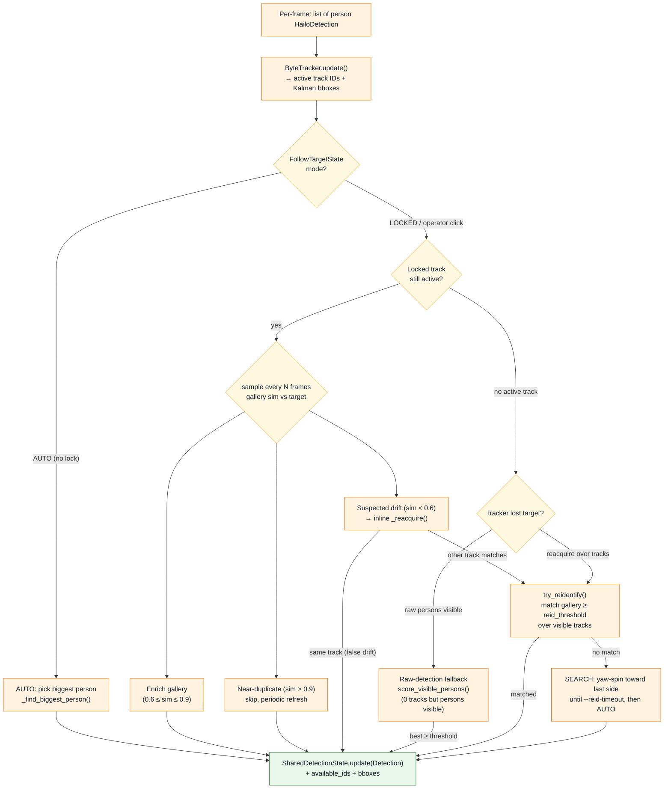
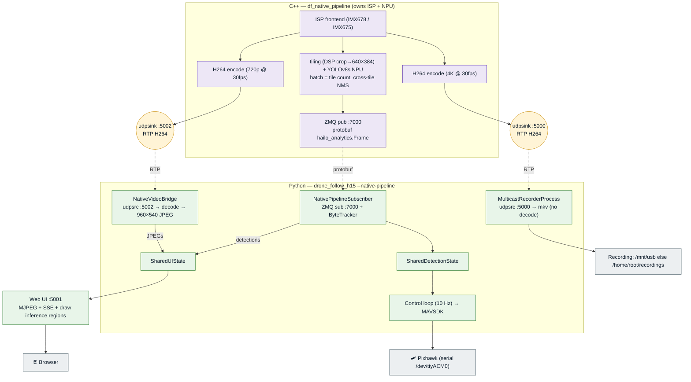

# Architecture & Data Flow

How a photon becomes a motor command. This document traces the full path from
the **camera sensor**, through the **Hailo NPU detection pipeline**, into the
**tracking / ReID / target-selection** logic, across the **shared-state
boundary**, into the **decision (controller) + robot adapter**, and out to the
**flight controller** — plus the parallel branch that feeds the **web UI /
OpenHD** and takes **operator input** back in.

Two production run-paths exist:

1. **Main path** — `robot_follow_app.py`: a single in-process GStreamer +
   Hailo pipeline. This is the default on RPi 5 + Hailo-8L and on x86 dev
   machines. **Most of this document covers this path.**
2. **Native H15 path** — `drone_follow_h15.py --native-pipeline`: a C++ binary
   (`df_native_pipeline`) owns the ISP + NPU and publishes detections over ZMQ;
   Python runs only tracking + control + UI. See
   [§ Native H15 pipeline](#native-h15-pipeline) below.

> The diagrams are [Mermaid](https://mermaid.js.org/) and render natively on
> GitHub. Colour = layer: 🔵 sensor/source · 🟣 NPU inference · 🟠 per-frame
> callback · 🟢 shared state · 🔴 decision/control · 🟥 robot/actuator ·
> 🩵 video-out / UI.

---

## Main path — end to end

### Reading the diagram

- **The main loop is synchronous per frame** (layers ①–④ run inside the
  GStreamer streaming thread via `app_callback`). ByteTracker and ReID both run
  *in the callback*, not on a background thread.
- **The shared-state layer (④) is the only thread boundary.** The vision
  callback writes; the control loop (⑤, its own asyncio thread at 10 Hz) and the
  servers (⑦, their own threads) read. All access is lock-guarded.
- **Video and control diverge after the callback.** The same detections drive
  both the controller (⑤→⑥) and the on-screen overlay (⑦); the MJPEG branch
  taps *clean* frames (no overlay) so the browser draws its own boxes from SSE.
- **Operator input flows backwards** through ⑦: a click in the browser →
  `FollowServer` → `FollowTargetState`, which the callback reads next frame to
  switch AUTO→LOCKED. OpenHD ground-station input arrives via `OpenHDBridge`.

---

## Zoom-in: the per-frame decision (tracking → ReID → target)

Layer ③ is where "which pixels are the person we follow" is decided. This is
the most subtle part of the system. Full algorithm:
[`docs/tracking-reid-algorithm.md`](tracking-reid-algorithm.md).

**Follow modes** (`follow_api/follow_mode.py`, wire values for OpenHD):

| Mode | `follow_id` | Meaning |
|------|:----------:|---------|
| **AUTO** | `0` | Follow the largest person; ReID gallery built for recovery. |
| **LOCKED** | `N` | Operator locked onto track/person `N` (click or REST). |
| **SEARCH** | — | Transient: target lost, ReID searching / yaw-spinning. |
| **IDLE** | `-1` | Hold position, ignore all detections. |

---

## Native H15 pipeline

On the **Hailo-15** target, inference is split out into a C++ binary
(`df_native_pipeline`, in [`robot_follow/native_pipeline/`](../robot_follow/native_pipeline/README.md))
that owns the ISP + NPU and publishes protobuf detections over ZMQ. The Python
orchestrator (`drone_follow_h15.py --native-pipeline`) runs **only** ByteTracker,
the follow loop, and the servers — layers ④–⑦ above are identical; layers ①–③
move into C++ and cross a ZMQ boundary. Enables per-tile inference regions
drawable from the web UI.

---

## Subsystem reference

| Layer | File | Key class / fn | Role & data produced |
|-------|------|----------------|----------------------|
| ① Source | `pipeline_adapter/hailo_drone_detection_manager.py` | `get_pipeline_string()` | Builds the GStreamer source per `--input` (rpi/usb/udp/shm). |
| ② Inference | *(same)* | `TILE_CROPPER_PIPELINE` + `INFERENCE_PIPELINE` | Tiling (3×2 + full, multi-scale) → YOLOv8 HEF on NPU → NMS `.so` → `HailoDetection`. |
| ③ Callback | *(same)* | `app_callback` → `_app_callback_inner`, `_run_tracker` | Filters persons, runs tracker, drives target state machine, emits `Detection`. |
| ③ Tracking | `pipeline_adapter/byte_tracker.py`, `tracker.py`, `tracker_factory.py` | `ByteTrackerAdapter`, `MetricsTracker` | Nx5 array → persistent IDs + Kalman bboxes. `--tracker {byte\|fast}`. |
| ③ ReID | `pipeline_adapter/reid_manager.py` | `ReIDManager` (`update_gallery`, `_reacquire`, `try_reidentify`, `score_visible_persons`) | Appearance gallery, drift-guard, re-acquisition, raw-detection fallback. `repvgg_a0` HEF. |
| ④ State | `follow_api/state.py` | `SharedDetectionState`, `FollowTargetState` | Thread-safe hand-off: detection→control, and who-to-follow. |
| ④ UI state | `servers/web_server.py` | `SharedUIState` | Latest JPEG frame + detection dicts + velocity + tiles. |
| ⑤ Loop | `robot_api/orchestrator.py` | `run_robot_loop()` | 10 Hz: read state → compute → send. Robot-agnostic. |
| ⑤ Controller | `follow_api/controller.py`, `config.py`, `types.py` | `compute()`, `ControllerConfig`, `RobotCommand` | Pure decision: yaw-P + distance-P → velocity command. `--yaw-only` zeroes forward. |
| ⑥ Adapter | `robot_api/adapters/mavsdk_drone.py`, `ros2_rover.py` | `MavsdkDroneAdapter`, `Ros2RoverAdapter` | Smoothing, altitude-P, safety, transport. `--robot {drone\|rover}`. |
| ⑦ Video out | `pipeline_adapter/vision_branches.py` | `assemble_output_stage`, `highlight_target` | `tee` → MJPEG / OpenHD H264 / display / record; target-cross overlay probe. |
| ⑦ Web | `servers/web_server.py` | `WebServer` :5001 | MJPEG (`/api/video`), SSE (`/api/detections/stream`), live config. |
| ⑦ Follow API | `servers/follow_server.py` | `FollowServer` :8080 | `POST /follow/<id>` click-to-follow, stale-id IoU recovery. |
| ⑦ OpenHD | `servers/openhd_bridge.py` | `OpenHDBridge` :5510/:5511 | MAVLink param ⇄ `ControllerConfig`; `follow_id` semantics. |
| Wiring | `robot_follow_app.py` | `main()`, `decide_branches` | Constructs and connects everything above. |

## CLI flags that reroute the flow

| Flag | Effect on the diagram |
|------|-----------------------|
| `--input {rpi\|usb\|udp://\|shm://}` | Selects the ① source branch. |
| `--webui` / `--openhd` (mutually exclusive) / `--display` / `--record` | Which ⑦ output branches are built. No UI flag → display defaults on. |
| `--yaw-only` / `--no-yaw-only` | Controller (⑤) zeroes forward+altitude, or full follow. |
| `--no-reid`, `--reid-*`, `--update-interval` | Disable / tune the ③ ReID gallery + drift logic. |
| `--auto-select` / `--no-auto-select` | On loss: re-acquire in AUTO vs hold IDLE. |
| `--tracker {byte\|fast}` | Which tracker in ③. |
| `--robot {drone\|rover}` | Which ⑥ adapter. |
| `--connection` / `--serial[-baud]`, `--takeoff-landing`, `--auto-offboard`, `--target-altitude` | ⑥ drone transport + offboard behaviour. |
| `--native-pipeline` (H15) | Switches to the [native pipeline](#native-h15-pipeline) (① –③ in C++ over ZMQ). |
| `--control-loop-hz` (10) | ⑤ tick rate. |

---

*Generated from the code as of branch `hailo15_tiling_optimize`. When the
pipeline shape, shared-state contract, or adapter surface changes, update the
Mermaid blocks above so this stays the source-of-truth architecture map.*
