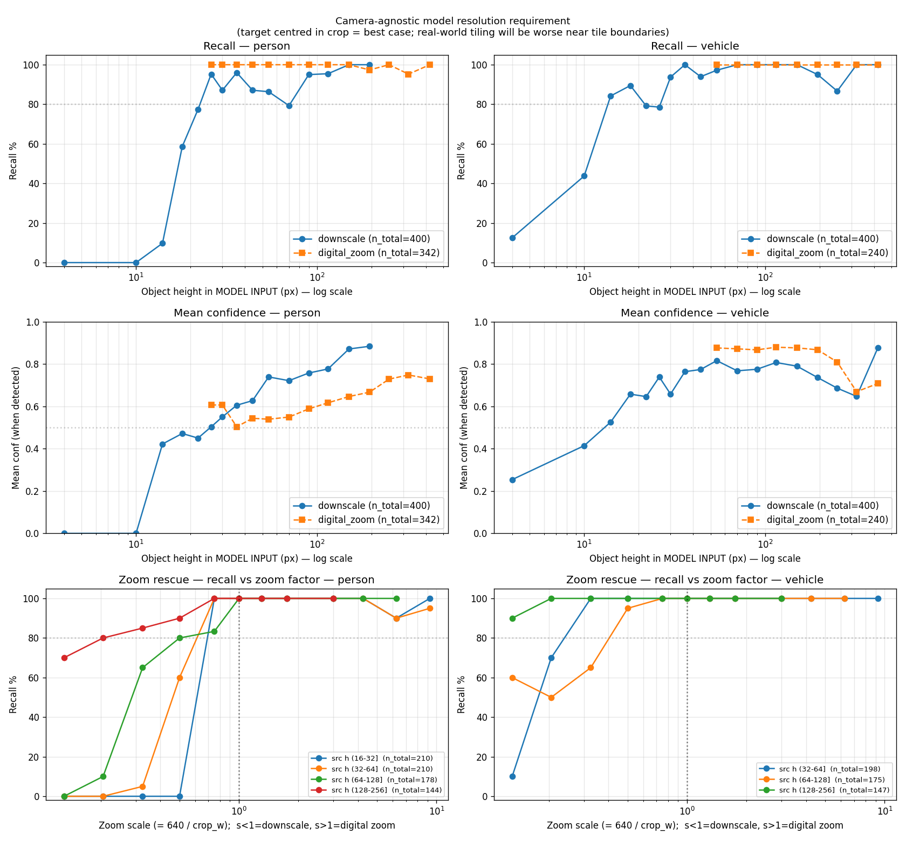
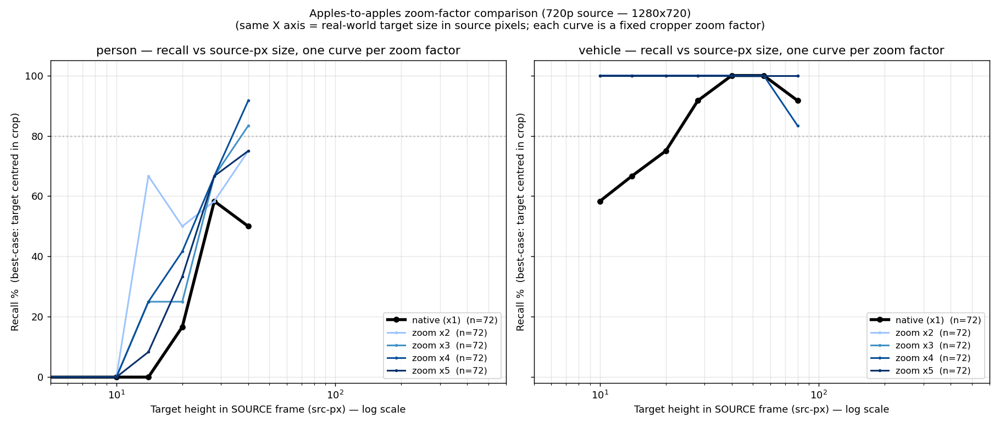
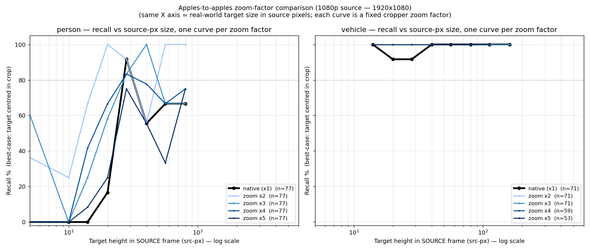
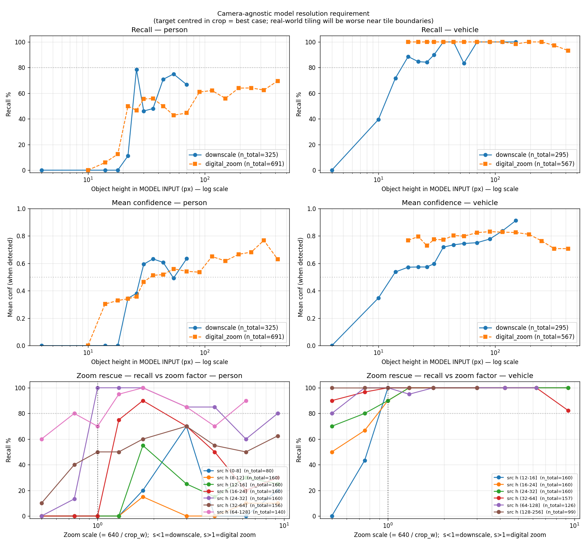

# Tiling Benchmark — Performance Report

**Last updated**: 2026-05-26
**Test video**: `DJI_20260430103421_0010_D_rotated.MP4` (6016 × 3384 native, 1036 frames, 29.97 fps, ≈34.5 s) — fixed-camera aerial drone scene with people + vehicles at varying distances.
**Model**: `hailo_yolov8n_4_classes_vga.hef` — 640 × 480 RGB input, 4 classes (`person`, `vehicle`, `face`, `license_plate`), on-chip NMS threshold 0.5.
**Hardware**: Hailo-10H PCIe accelerator, x86_64 host.
**Pseudo-GT used throughout**: `GT-12x9-25-multi` — 12 × 9 dense grid (≈650 × 484 src-px per tile, 25 % overlap) tagged `,m` + 1 × 1 full frame + 3 × 2 medium grid (≈2407 × 1934 src-px, 25 % overlap) + centred VGA-3x rescue rect (1920 × 1440 src-px = exact 3× integer downscale to model input). All extras tagged `,s`. 116 rects per frame, aggregator-side `border-threshold=0.005`.

---

## 1. Units & variables

Recurring symbols in every table below. Read this once.

| Symbol / column | Meaning | Unit |
|---|---|---|
| **src-px** | Pixels in the **raw camera frame**, before any tiling or cropper resize. For this video the source is 6016 × 3384, so `src_h_px` runs 0…3384 along the height axis. Camera-dependent. | px |
| **model-px** | Pixels in the **model input**, after the cropper has resized whatever tile/crop is being inferred. The model input is 640 × 480 for this HEF, so `model_h_px` runs 0…480 along the height axis. Camera-agnostic. | px |
| **height** | Bounding box height. Used as the primary "size" axis for recall binning. | px |
| **`src_h_px`** | Object height in source pixels (= `bbox_h_norm × src_h`). | src-px |
| **`model_h_px`** | Object height in model-input pixels after the cropper resize. Camera-agnostic. | model-px |
| **`crop_w` / `crop_h`** | Width / height (in source pixels) of the crop region the cropper sends to the model. Always 4 : 3 aspect ratio in the probe; resized to 640 × 480 before inference. | src-px |
| **`scale`** | Resize factor applied by the cropper. `scale = 640 / crop_w` (= `480 / crop_h`). `scale < 1` = downscale (crop bigger than model input). `scale > 1` = digital zoom (crop smaller than model input, upscaled). | dimensionless |
| **`recall %`** | Per-bin: of the GT objects whose `src_h_px` falls in the bin, what fraction was matched by *any* run-output detection of the same class. Greedy IoU ≥ 0.5 matching for run results vs GT; IoU ≥ 0.3 for the zoom probe (single-target match in model coords). | % |
| **`det/frame`** | Mean number of post-NMS detections per processed frame. | dets / frame |
| **`mean conf`** | Mean confidence of post-NMS detections in a config. | 0…1 |
| **`fwd %`** | Fraction of frames that produced ≥ 1 detection of any class. | % |
| **`wall s`** | End-to-end wall-clock seconds for the GStreamer run over the full 1036-frame video. Includes decode, scheduling, inference, post-process. | s |
| **`tiles_x` × `tiles_y`** | Static tile grid dimension. Total grid tiles = product; extras add on top. | count |
| **`border_threshold`** | Aggregator parameter: a per-tile detection whose bbox edges sit within this fraction of the tile edge (in tile-normalized coords) is dropped — eliminates fragments touching boundaries. `0.005` is the recommended default. | 0…1 |
| **Native / no-tiling** | Single 1 × 1 tile = the whole source frame, resized once to model input. The coarsest possible view. | — |
| **Digital zoom** | Cropping a sub-region smaller than model input and resizing it **up** to 640 × 480. The model gets more pixels per object but the source pixel density is unchanged — interpolation can't add detail that was never sampled. | — |

**Size bins (`src_h_px` — bbox height in raw 6K-camera pixels)** used throughout: `(16, 32]`, `(32, 64]`, `(64, 128]`, `(128, 256]`, `(256, ∞]`. Anything below 16 src-px (= < ≈0.5 % of the 3384 src-px frame height) is treated as "below detector floor" and reported as a `(0, 16]` row. **The bins do NOT change meaning based on tile size** — they always describe the object's size in the original 6016 × 3384 frame.

---

## 2. Method

`run_pxt_bench.py` runs the same GStreamer pipeline used in production
(`drone_follow/pipeline_adapter`) with the bench probe wired in. Every
configuration is one full pass over the 1036-frame video, no frame skipping.
Each pass produces:

- `pxt_<label>.json` — top-level summary (per-second + per-bin counts, conf
  distribution, wall time).
- `pxt_<label>.frames.json` — per-frame detection list in source-normalized
  bbox coords; used by `analyze_pxt.py` (recall matching), `overlay_viewer.py`
  (visual review), and `clean_frames.py` (post-hoc phantom + containment
  merge if needed).

`analyze_pxt.py` does greedy IoU matching between each config's
`frames.json` and the GT's `frames.json`, class-aware, then bins by
`src_h_px`. Same-class greedy match, IoU ≥ 0.5.

`zoom_probe.py` is a different beast — it bypasses GStreamer entirely and
drives the HEF directly via `HefHandle` (from `probe_phantom_hef.py`),
making a controlled single-crop inference per (target, crop_size) cell.
That isolates the model's response to a target at known source-px size and
known cropper `scale`, without the rest of the pipeline.

---

## 3. Per-config throughput / det counts

Full sweep against the May-26 GT. `--border-threshold 0.005` applied
uniformly. `1x1-640x480` is excluded — known SIGSEGV regression when the
source caps match the model input caps (degenerate caps-negotiation path).
The `+vga3x` rows add a single centred VGA-3x rescue rect (1920 × 1440
src-px → exact 3× integer downscale to model input) to each base grid —
+1 tile per frame.

**`rt_factor` (realtime factor)** = `chip_inf/s / required_inf/s` with
`chip_inf/s = 300` (sustained on-chip throughput on this Hailo-10H) and
`required_inf/s = N_tiles × video_fps`, assuming a 30 fps live stream.
`rt_factor ≥ 1` = the chip can keep up with 30 fps. `< 1` = would drop
frames (the wall-clock numbers in this table are batched offline, so
they don't show this directly). `rt_factor = chip_fps / (N × 30) = 10 / N`
for `chip_fps = 300, video_fps = 30`.

| Config | grid | extras | tiles | `rt_factor` | RT @ 30 fps | `fwd %` | `det/frame` | `mean conf` | `wall s` |
|---|:---:|:---|---:|---:|:---:|---:|---:|---:|---:|
| **GT-12x9-25-multi** (reference) | 12 × 9 | 1 × 1, 3 × 2, center_vga_3x | 116 | 0.09 | ✗ | 100.0 | 5.952 | 0.804 | 391.5 |
| 1x1-native (no tiling) | 1 × 1 | — | 1 | 10.00 | ✓ | 31.7 | 0.512 | 0.652 | 82.4 |
| 2x2-native | 2 × 2 | — | 4 | 2.50 | ✓ | 90.7 | 1.957 | 0.672 | 85.9 |
| 3x2-native | 3 × 2 | — | 6 | 1.67 | ✓ | 97.3 | 2.802 | 0.692 | 84.6 |
| 3x3-native | 3 × 3 | — | 9 | 1.11 | ✓ | 99.4 | 3.030 | 0.705 | 85.2 |
| 4x3-native | 4 × 3 | — | 12 | 0.83 | ✗ | 100.0 | 4.058 | 0.735 | 87.4 |
| 6x4-native | 6 × 4 | — | 24 | 0.42 | ✗ | 100.0 | 4.976 | 0.768 | 91.5 |
| 8x6-native | 8 × 6 | — | 48 | 0.21 | ✗ | 100.0 | 5.346 | 0.788 | 156.5 |
| 4x3-native+full | 4 × 3 | + 1 × 1 full | 13 | 0.77 | ✗ | 100.0 | 4.058 | 0.735 | 87.2 |
| **2x2+vga3x** | 2 × 2 | + center_vga_3x | 5 | **2.00** | ✓ | 99.9 | **3.020** | 0.706 | 78.1 |
| **3x2+vga3x** | 3 × 2 | + center_vga_3x | 7 | **1.43** | ✓ | 99.7 | 3.309 | 0.707 | 81.5 |
| **3x3+vga3x** ⭐ | 3 × 3 | + center_vga_3x | **10** | **1.00** | ✓ exactly | 100.0 | **3.687** | 0.716 | 78.5 |
| 4x3+vga3x | 4 × 3 | + center_vga_3x | 13 | 0.77 | ✗ | 100.0 | 4.173 | 0.736 | 81.3 |
| 6x4+vga3x | 6 × 4 | + center_vga_3x | 25 | 0.40 | ✗ | 100.0 | 5.056 | 0.769 | 85.3 |
| 8x6+vga3x | 8 × 6 | + center_vga_3x | 49 | 0.20 | ✗ | 100.0 | 5.595 | 0.787 | 158.8 |

Notes:

- Pipeline overhead dominates below ≈12 tiles: 1 × 1 through 4 × 3 all
  land in the same 78-88 s wall-clock band. Chip throughput stabilises
  at ≈320 inf/s for 6 × 4 and denser.
- `4x3-native+full` is **byte-identical** to `4x3-native` (same 4204
  dets, same mean conf). The full-frame extra downscales 9.4× to fit
  the model input — at this source resolution it contributes zero net
  detections (everything it could find is already found by the dense
  grid). See §9 for the underlying reason (model resolution floor).
- **+vga3x is essentially free at runtime** (+1 tile / frame) and pays
  off big on the smaller grids. The rescue is documented in §4.3.
- **`3x3+vga3x` sits exactly at the chip-throughput boundary** (10
  tiles × 30 fps = 300 inf/s). The best recall you can get and still
  run real-time on this hardware at 30 fps.

---

## 4. Size-binned recall vs GT

Total GT objects in the May-26 GT: person=1972, vehicle=3706, face=125,
license_plate=363.

### 4.1 Person — recall % by source-pixel height bin

n_gt: (16, 32]=38, (32, 64]=221, (64, 128]=1034, (128, 256]=679.

**Base grids only:**

| bin (src-px h) | 1 × 1 | 2 × 2 | 3 × 2 | 3 × 3 | 4 × 3 | 6 × 4 | **8 × 6** |
|---|---:|---:|---:|---:|---:|---:|---:|
| (16, 32] | 0 % | 0 % | 0 % | 0 % | 0 % | 0 % | **44.7 %** |
| (32, 64] | 0 % | 0 % | 0 % | 0 % | 0.5 % | 16.7 % | **59.3 %** |
| (64, 128] | 0 % | 7.5 % | 17.2 % | 23.1 % | 46.0 % | 78.4 % | **83.7 %** |
| (128, 256] | 21.1 % | 44.9 % | 52.6 % | 50.8 % | 60.8 % | 78.6 % | **87.0 %** |
| **TOTAL** | 7.3 % | 19.4 % | 27.1 % | 29.6 % | 45.1 % | 70.1 % | **81.3 %** |

**Same grids with `+vga3x` rescue:**

| bin (src-px h) | 2 × 2+vga3x | 3 × 2+vga3x | **3 × 3+vga3x** | 4 × 3+vga3x | 6 × 4+vga3x | 8 × 6+vga3x |
|---|---:|---:|---:|---:|---:|---:|
| (16, 32] | 0 % | 0 % | 0 % | 0 % | 0 % | 44.7 % |
| (32, 64] | 0.9 % | 0.9 % | 0.9 % | 1.4 % | 16.7 % | 59.3 % |
| (64, 128] | 37.5 % | 37.6 % | **38.5 %** | 50.2 % | 79.7 % | **84.3 %** |
| (128, 256] | 57.7 % | 59.1 % | 58.3 % | 62.2 % | 78.8 % | **89.7 %** |
| **TOTAL** | **39.7 %** | 40.2 % | **40.4 %** | 47.9 % | 70.8 % | **82.6 %** |

- The +vga3x rescue tile lifts mid-range (64-256 src-px) person recall
  dramatically on the smaller grids. `2 × 2+vga3x` doubles TOTAL recall
  (19.4 % → 39.7 %) for the cost of one extra tile.
- `3 × 3+vga3x` is the sweet spot at the realtime boundary: 40.4 % TOTAL
  vs `3 × 3`'s 29.6 % — same realtime feasibility, +10 absolute points.
- Tiny persons (16-32 src-px) still need the 8 × 6 grid; the centred
  VGA-3x tile can't see them either because they're not in the action
  band the rescue tile covers.

### 4.2 Vehicle — recall % by source-pixel height bin

n_gt: (32, 64]=1198, (64, 128]=1740, (128, 256]=454, (256, ∞]=314.

**Base grids only:**

| bin (src-px h) | 1 × 1 | 2 × 2 | 3 × 2 | 3 × 3 | **4 × 3** | **6 × 4** | 8 × 6 |
|---|---:|---:|---:|---:|---:|---:|---:|
| (32, 64] | 0 % | 29.4 % | 41.0 % | 81.3 % | 93.7 % | **98.6 %** | 98.9 % |
| (64, 128] | 0.2 % | 47.2 % | 70.2 % | 58.3 % | 80.2 % | 93.6 % | **99.1 %** |
| (128, 256] | 34.8 % | 54.8 % | 91.2 % | 80.8 % | **98.7 %** | 98.5 % | 96.9 % |
| (256, ∞] | 71.3 % | 69.4 % | 76.1 % | 59.6 % | **99.7 %** | 89.8 % | 30.9 % |
| **TOTAL** | 10.4 % | 44.3 % | 63.8 % | 68.6 % | 88.5 % | **95.5 %** | 93.0 % |

**Same grids with `+vga3x` rescue:**

| bin (src-px h) | 2 × 2+vga3x | 3 × 2+vga3x | 3 × 3+vga3x | **4 × 3+vga3x** | **6 × 4+vga3x** | **8 × 6+vga3x** |
|---|---:|---:|---:|---:|---:|---:|
| (32, 64] | 31.6 % | 42.6 % | 81.3 % | 93.7 % | **98.6 %** | 98.9 % |
| (64, 128] | 69.1 % | 77.6 % | 73.4 % | 83.2 % | **95.1 %** | **99.4 %** |
| (128, 256] | 97.8 % | 99.3 % | 98.7 % | **99.6 %** | 99.3 % | 99.3 % |
| (256, ∞] | 98.1 % | 99.4 % | 96.8 % | **100 %** | 99.4 % | 96.5 % |
| **TOTAL** | 63.0 % | 70.8 % | 81.0 % | **90.0 %** | **97.1 %** | **99.0 %** |

### 4.3 The center-tile rescue fixes the fragment-vs-whole collapse

The most dramatic single result of the +vga3x experiment:

| Vehicle (256, ∞] | Base grid | + vga3x | Δ |
|---|---:|---:|---:|
| 4 × 3 | 99.7 % | **100 %** | +0.3 |
| 6 × 4 | 89.8 % | **99.4 %** | +9.6 |
| 8 × 6 | **30.9 %** | **96.5 %** | **+65.6** |

The boundary-strip in the May-26 GT recipe suppresses fragments at
dense tile boundaries — so on the dense 8 × 6 grid, large vehicles
(which span 3-4 tiles each) produce no per-tile-fragment win and the
*aggregator drops them entirely*. The centred VGA-3x rescue rect sees
the whole vehicle at its 3 × downscale and supplies the winning
detection. **+ 65.6 absolute recall points from one extra inference
per frame.** This is the production-grade fix for the architectural
NMS flaw documented in §8.1 / §9.1.

Vehicle TOTAL recall lifts to **99.0 %** on `8 × 6 + vga3x` — the
single best vehicle recall we have measured.

### 4.3 Face & license_plate

n_gt: face=125 (almost all in 16-32 bin), license_plate=363 (155 in (0, 16] + 187 in (16, 32]).

| Class | 4 × 3 | 6 × 4 | 8 × 6 |
|---|---:|---:|---:|
| face TOTAL | 0 % | 2.4 % | **4.8 %** |
| license_plate TOTAL | 0 % | 12.9 % | **43.0 %** |

Tiny secondary classes; included for completeness. License plates need
the densest tiling (and even then only ≈half are recovered) — see §5
for why these classes hit the model's resolution floor.

---

## 5. Camera-agnostic model resolution requirement

The "how big must the object be?" question, asked in **model-input pixels**
so the answer is camera-agnostic. Use this to predict the smallest object
your tiling will detect on *any* camera + lens + drone-to-target distance.

### 5.1 Method (zoom probe)

`tiling_benchmark/zoom_probe.py` — runs `hailo_yolov8n_4_classes_vga.hef`
directly (no GStreamer). For each selected target:

1. Sample N targets per (class × `src_h_px` bin) from the May-26 GT,
   filtered to GT conf ≥ 0.5, not touching the frame edge, sane aspect
   ratio. Two source-resolution sweeps are run: the original 6K source
   (this section, §5.3) and a pre-rescaled 1920 × 1080 source (§6) so
   that sub-16 src-px targets exist in the test set.
2. Sweep crop widths `crop_w ∈ {4512, 3008, …, 160, 128, 96, 80, 64}`
   src-px. For each: build a 4 : 3 crop centred on the target bbox,
   clip to source, resize to 640 × 480 (`INTER_AREA` for downscale,
   `INTER_LINEAR` for upscale — matches the GStreamer videoscale
   default), run inference.
3. Compute `model_h_px = src_h_px × (480 / crop_h)`.
4. Match output detections back to the target's expected position in
   model coords (best IoU per class, threshold 0.3).

Two regimes:

- **Downscale** — `crop_w ≥ 640 AND crop_h ≥ 480`. The crop is at least
  as large as model input. The model sees the target at native source
  pixel density × the downscale ratio. Mirrors a real tile that's
  larger than 640 × 480.
- **Digital zoom** — `crop_w < 640 OR crop_h < 480`. Source crop is
  smaller than model input, resized **up**. Mirrors a tight rescue
  tile around a known target — more model pixels but same source pixel
  density underneath.

### 5.2 Best-case caveat

The target is **centred** in every probe crop. Real-world tiling can
land the target anywhere inside (or astride the edge of) a tile;
recall and confidence at the same `model_h_px` will be lower in
practice. These curves are the **upper bound** the model can achieve;
clever dynamic tiling (one tile per candidate target, centred) is the
mechanism that lets a real pipeline approach this bound.

### 5.3 Downscale regime — minimum object size

Plot (6K source): top row = recall vs `model_h_px`, middle row = mean
confidence (detected only), bottom row = continuous zoom-rescue curves.
Columns are person / vehicle.



Recall vs object height in model-input pixels. Confidence is averaged
**only over detected samples** (so a 0-recall bin doesn't drag the
conf curve down).

| `model_h_px` | person recall | person conf | vehicle recall | vehicle conf |
|---:|---:|---:|---:|---:|
| (0, 16] | 0 % | — | 0-71 % rising | rising |
| (16, 20] | 0 % | — | 71 % | 0.61 |
| (20, 24] | 53 % | 0.33 | 86 % | 0.70 |
| (24, 28] | 73 % | 0.40 | 92 % | 0.69 |
| (28, 32] | **90 %** | 0.54 | 93 % | 0.69 |
| (32, 40] | **100 %** | 0.69 | **100 %** | 0.78 |
| (40, 80] | 87-100 % | 0.71-0.75 | 97-100 % | 0.78-0.82 |
| > 80 | 100 % | 0.77-0.83 | 100 % | 0.77-0.88 |

**Headline thresholds (model_h_px, downscale, target centred):**

| Class | ≥ 80 % recall | ≥ 95 % recall | Hard cliff (0 % recall below) |
|---|---:|---:|---:|
| Person | 28-32 model-px | 32 model-px | 20 model-px |
| Vehicle | 12-16 model-px | 32 model-px | 8 model-px |

Vehicles need ≈half the model-px size of persons for equal recall.

### 5.4 What this means for tile-grid choice

To detect an object of source height `H_src` (real-world) you need at
least `model_h_px ≥ M_min` (28 for persons, 12 for vehicles at 80 %
recall). The cropper resizes a tile of height `tile_h` src-px down to
480 model-px, so `model_h_px = H_src × (480 / tile_h)`. Re-arranged:

```
tile_h_max = H_src × (480 / M_min)
```

For this source (3384 src-px tall, M_min=28 for person@80 %):

| Real-world object src-px h | tile_h_max for 80 % person recall | Required `tiles_y` (no overlap) |
|---:|---:|---:|
| 200 src-px (close person) | 3429 src-px | 1 (no tiling) |
| 100 src-px (medium) | 1715 src-px | 2 |
| 50 src-px (far) | 857 src-px | 4 |
| 32 src-px (very far) | 549 src-px | 7 |
| 20 src-px (limit) | 343 src-px | 10 |

That is the math behind the `8 × 6 dense` recommendation in §4.1 — at
the smallest practical object size for this camera, the y-dimension
needs ≈6 tiles per axis just to put 28 model-px on a 32 src-px target.
Beyond that, you've hit the camera's pixel-density floor and need
either a closer pass or higher-resolution capture.

---

## 6. Digital-zoom rescue effect — very small targets

The §5 numbers say "what `model_h_px` do you need". This section
answers the operationally important follow-up: **on targets that the
1 : 1 cropper (scale = 1.0, model sees the object at its source-pixel
size) fails to detect, does digital zoom recover them — and how
small a source object can zoom save?**

This is the test that matters for tile design. If a real-world far-
target deposits only 10 src-px of vertical detail on the sensor,
can a tight zoomed rescue tile still pick it up, or has the sensor
already lost the game?

### 6.1 Source: rescaled 1080p video

The original 6016 × 3384 video's smallest GT person is 23 src-px tall
— the dense 12×9 grid that built the GT can't detect anything
smaller in this content, so the GT contains nothing below that.

To probe sub-16 src-px targets we **rescale the source down to 1920 × 1080**
once with ffmpeg (INTER_AREA / `flags=area`) and run the probe directly
on that. The same GT (normalized bbox coords are resolution-independent)
applies; what was a 50 src-px person in 6K becomes a ≈16 src-px
person in 1080p — same object, less pixel density, mirroring "drone
3× farther away" or "camera 3× lower resolution".

Source file: `pxt_runs/scaled_sources/DJI_1080p.mp4` (35 s, 1035 frames).
For sub-10 src-px vehicle data we additionally run on a 1280 × 720
rescale (`pxt_runs/scaled_sources/DJI_720p.mp4`) where the smallest
GT vehicles drop to ≈9 src-px — see §6.7.

### 6.1.1 Sanity-check audit: are the small targets real?

A contact-sheet audit of the actual probed targets per (class, src-px
h bin) — bbox on a 3×-side context crop — is generated by
`zoom_probe_audit.py` (output to `pxt_runs/`, not committed). Regenerate
with the command in §11. Summary of what it shows:

**What the audit shows.** Persons in (8, 24] are visibly real (small
but resolvable). The (0, 8] person bin (n=5) sits on the edge — some
look like real persons compressed by distance, others are dark blobs
that may be GT artefacts. We weight the headline conclusions on the
(8, 12] and (12, 16] bins where the GT is unambiguous. Vehicles in
(12, 16] are clearly real cars in every shown sample. There is no
sub-10 src-px vehicle in 1080p source — the smallest GT vehicle is
≈14 src-px (= 44 src-px in 6K) because the dense 12 × 9 grid that
built the GT can't see anything smaller, and the test scene contains
no further-distance vehicles. To get sub-10 src-px vehicle data we
re-run the probe on the 720p rescale; see §6.7.

### 6.2 Comparison: native (scale = 1.0) vs digital zoom

For each probe target the **native** column is the row whose cropper
`scale ≈ 1.0`, i.e. `crop_w = 640 src-px` — the model sees the target
at its true source-pixel height (`model_h_px = src_h_px`). The
**zoom_best** column is the best result across all `scale > 1.05`
rows for the same target.

| Class | src-px h bin | n | **native @ scale 1.0** | **zoom_best (scale > 1)** | rescued by zoom |
|---|---|---:|---:|---:|---:|
| Person | (0, 8] | 5 | 0 % | **100 %** | 100 % |
| Person | (8, 12] | 10 | 0 % | **40 %** | 40 % |
| Person | (12, 16] | 10 | 0 % | **80 %** | 80 % |
| Person | (16, 24] | 10 | 0 % | **100 %** | 100 % |
| Person | (24, 32] | 10 | 100 % | 100 % | 0 % |
| Person | (32, 64] | 10 | 50 % | **100 %** | 50 % |
| Person | (64, 128] | 10 | 70 % | **100 %** | 30 % |
| Vehicle | (12, 16] | 10 | 100 % | 100 % | 0 % |
| Vehicle | (16, 24] | 10 | 90 % | 100 % | 10 % |
| Vehicle | (24, 32] | 10 | 90 % | 100 % | 10 % |
| Vehicle | (32, 64] | 10 | 100 % | 100 % | 0 % |
| Vehicle | (64, 128] | 10 | 100 % | 100 % | 0 % |
| Vehicle | (128, 256] | 9 | 100 % | 100 % | 0 % |

**Reading the table.** "native @ scale 1.0" means crop_w = 640 src-px,
crop_h = 480 src-px — the smallest 4 : 3 crop that doesn't require
upscaling, model sees the target at exactly its src-px size. "rescued
by zoom" = the fraction of targets that *fail* at native but *succeed*
with some `scale > 1`.

### 6.3 What the data says

Headline findings:

- **Person detection floor (no zoom)**: ≈ 24 src-px height in
  the 1080p source. Below that, native scale = 1.0 catches nothing.
  Above that, native catches everything.
- **Person rescue floor (with zoom)**: ≈ 12 src-px height. Above this,
  digital zoom recovers ≥ 80 % of targets. Below this, source pixel
  density itself is the limit and even max zoom rescues only some of
  them (40 % at 8-12, 100 % at 0-8 but n=5).
- **Vehicle floor**: extreme — vehicles need only **12 src-px** in
  source to be detected reliably at native scale. Zoom barely
  contributes (the (16, 32] bins each pick up the odd straggler).
- The (32, 64] and (64, 128] person bins show "rescue" rates of 50 %
  and 30 % because some targets in those bins are hard for unrelated
  reasons (pose, partial occlusion, similar-coloured background) and
  the model only finds them when more model-input pixels per object
  are available.

In short: **digital zoom DOES rescue very small persons** — anything
≥ 12 src-px in the source can usually be recovered by a tight enough
crop. Below 12 src-px the rescue rate drops to 40 % and the source
information runs out.

### 6.4 Apples-to-apples: recall at each discrete zoom factor

`pxt_runs/zoom_compare_{720p,1080p}.png` answers "is x2 enough, or
does x3 / x4 give meaningfully better recall?" directly:

- **X-axis**: target height in **source pixels** (`src_h_px`) — the
  real-world quantity. *Same axis for every curve* so you read each
  vertical slice as "for a target of this physical size in source,
  what's the model's recall?"
- **Y-axis**: recall %.
- **Curves**: one per fixed cropper zoom factor — **x1 = native**
  (`crop_w = 640`, no rescaling: model gets the source pixels
  unchanged), x2, x3, x4, x5.

The probe sweeps `crop_w ∈ {640, 320, 213, 160, 128}` src-px to land
exactly on these factors. Run on the 720p and 1080p rescaled source
(see §6.1 / §6.7) so the small-src-px regimes are populated.




#### Person — recall per (src_h_px, zoom factor)

**1080p source** (smallest src bins well populated):

| src_h_px bin | x1 (native) | **x2** | x3 | x4 | x5 |
|---|---:|---:|---:|---:|---:|
| (0, 8] | 0 % | 40 % | **80 %** | 0 % | 0 % |
| (8, 12] | 0 % | **25 %** | 0 % | 0 % | 0 % |
| (12, 16] | 0 % | **67 %** | 25 % | 42 % | 8 % |
| (16, 24] | 17 % | **100 %** | 58 % | 67 % | 25 % |
| (24, 32] | 92 % | 92 % | 83 % | 83 % | 75 % |
| (32, 48] | 56 % | 56 % | **100 %** | 78 % | 56 % |
| (48, 64] | 67 % | **100 %** | 67 % | 67 % | 33 % |
| (64, 96] | 67 % | **100 %** | 67 % | 75 % | 75 % |

**720p source** (more aggressive resize, fewer bins but cross-checks the curve):

| src_h_px bin | x1 (native) | **x2** | x3 | x4 | x5 |
|---|---:|---:|---:|---:|---:|
| (0, 8] | 0 % | 0 % | 0 % | 0 % | 0 % |
| (8, 12] | 0 % | 0 % | 0 % | 0 % | 0 % |
| (12, 16] | 0 % | **67 %** | 25 % | 25 % | 8 % |
| (16, 24] | 17 % | **50 %** | 25 % | 42 % | 33 % |
| (24, 32] | 58 % | 58 % | **67 %** | 67 % | 67 % |
| (32, 48] | 50 % | 75 % | 83 % | **92 %** | 75 % |

#### Vehicle — recall per (src_h_px, zoom factor)

| Source | src_h_px bin | x1 | x2 | x3 | x4 | x5 |
|---|---|---:|---:|---:|---:|---:|
| 720p | (8, 12] | 58 % | **100 %** | 100 % | 100 % | 100 % |
| 720p | (12, 16] | 67 % | **100 %** | 100 % | 100 % | 100 % |
| 720p | (16, 24] | 75 % | **100 %** | 100 % | 100 % | 100 % |
| 720p | (24, 32] | 92 % | **100 %** | 100 % | 100 % | 100 % |
| 720p | (32, 48]+ | 100 % | 100 % | 100 % | 100 % | 100 % |
| 1080p | (12, 16] | 100 % | 100 % | 100 % | 100 % | 100 % |
| 1080p | (16, 24] | 92 % | 100 % | 100 % | 100 % | 100 % |

#### Reading the curves: which zoom factor is best?

- **x2 is the practical sweet spot.** It's the smallest zoom that
  produces a big recall lift on marginal targets, and it's the most
  consistently best-or-tied across bins.
- **x3 occasionally beats x2** — `(0, 8]` person in 1080p (40 % → 80 %),
  `(32, 48]` person in 1080p (56 % → 100 %) — but it also costs
  recall in other bins. The pattern isn't reliable enough to choose
  x3 over x2 as a default.
- **x4 and x5 do not help further** and sometimes degrade. e.g. 1080p
  person `(48, 64]`: x2 = 100 %, x5 = 33 %. The upscale blur at
  higher zoom obscures features the model relied on at moderate
  scales.
- **Vehicles flat-line at 100 % from x2 onwards** at every src-px
  size ≥ 8. Zoom is a free win on vehicles; higher zoom factors
  are wasted scaling.

**Operational rule**: when adding a rescue tile (centred on a target
or interesting region), size it for **≈ x2 zoom** of the model
input — i.e. `crop_w ≈ 320 src-px`, `crop_h ≈ 240 src-px`. Going
tighter (x3-x5) rarely helps and often hurts.

### 6.5 Continuous-scale rescue curves (supplementary)

`pxt_runs/zoom_probe_1080p.png` row 3 plots recall as a function of a
continuous `scale = 640 / crop_w` (finer sweep than §6.4's discrete
points), one line per `src_h_px` bin. Use when you want to spot
non-monotone behaviour within a single src-px bin. For the
"is x2 enough vs x3" question, prefer §6.4.



The continuous probe used the full `crop_w` sweep `{4512, 3008, 2256,
1920, 1504, 1280, 1024, 880, 752, 640, 560, 480, 400, 320, 240,
192, 160, 128, 96, 80, 64}` (= `scale ∈ {0.14, 0.21, …, 10.0}`).

### 6.6 Zoom limit / where extra zoom stops helping

A single rescue at extreme zoom is not the whole story — confidence
also matters. From `zoom_probe_1080p.csv`:

- Person mean confidence (when detected) **peaks** at `scale ≈ 2-3` and
  declines past `scale ≈ 4` for most src-px bins.
- A 45 src-px hard person (target 35, frame 791 in the probe) is
  detected only at `scale ∈ {2.67, 3.33}` (model_h_px 122 - 153) and
  is lost again at higher zoom — the upscale blur eats the features
  that allowed detection at moderate zoom.

**Working zoom limit** (consistent with §6.4):

- **Default rescue tile**: zoom x2 — the most consistent winner across
  src-px bins for both classes. `crop_w = 320 src-px`.
- **Push to x3** when you know the target is tiny (`src_h_px ≤ 12`).
  The (0, 8] person bin shows x3 = 80 % vs x2 = 40 % in 1080p data
  — that's the one case x3 clearly beats x2.
- **Don't go beyond x3** unless the target is truly minute and the
  data shows a benefit. x4 / x5 routinely degrade recall vs x2-x3.
- **Recovery floor**: targets with `src_h_px ≤ 8` cannot be reliably
  rescued for the person class — even max zoom puts insufficient
  real detail into the model. Vehicles handle 8 src-px fine (lateral
  extent compensates).

### 6.7 720p source — sub-10 src-px regime, including vehicles

The 1080p source gets vehicles down to 14 src-px and persons down to
≈7 src-px. To probe the **sub-10 src-px vehicle regime** we rescale
again to 1280 × 720, halving the original 6K source per axis. Smallest
1080p vehicle (14 src-px) drops to ≈9 src-px here.

Source: `pxt_runs/scaled_sources/DJI_720p.mp4`. Probe artefacts:
`pxt_runs/zoom_probe_720p.{csv,png}`, audit
`pxt_runs/zoom_probe_720p_audit.png`.

| Class | src-px h bin | n | **native @ scale 1.0** | **zoom_best (scale > 1)** | rescued |
|---|---|---:|---:|---:|---:|
| Person | (0, 8] | 10 | 0 % | 0 % | 0 % |
| Person | (8, 12] | 10 | 0 % | 0 % | 0 % |
| Person | (12, 16] | 10 | 0 % | **70 %** | 70 % |
| Person | (16, 24] | 10 | 20 % | **70 %** | 50 % |
| Person | (24, 32] | 10 | 70 % | **100 %** | 30 % |
| Person | (32, 64] | 10 | 60 % | **100 %** | 40 % |
| **Vehicle** | **(8, 12]** | 10 | **70 %** | **100 %** | 30 % |
| Vehicle | (12, 16] | 10 | 70 % | **100 %** | 30 % |
| Vehicle | (16, 24] | 10 | 70 % | **100 %** | 30 % |
| Vehicle | (24, 32] | 10 | 100 % | 100 % | 0 % |
| Vehicle | (32, 64] | 10 | 100 % | 100 % | 0 % |
| Vehicle | (64, 128] | 10 | 100 % | 100 % | 0 % |

A 720p contact-sheet audit is generated by `zoom_probe_audit.py`
(output to `pxt_runs/`, not committed). Notable findings vs the 1080p run:

- **Vehicles are detectable at 8-12 src-px** — 70 % at native scale,
  100 % with zoom. Compare to persons in the same bin: 0 % even with
  max zoom. Vehicles have much wider lateral extent, so even when
  vertical pixel-count drops below 10 the model still has enough
  horizontal information.
- **Hard floor for persons: ≈12 src-px** in 720p. Below that even
  max zoom yields 0 % recall. (The 1080p run's 100 %-rescue
  reading for (0, 8] persons was the n=5 / ambiguous-GT case
  flagged in §6.1.1 — the 720p data with n=10 corrects it.)
- The smaller (16, 24] bin for both classes is weaker than the
  larger bins — at 720p those persons end up below the model's
  reliable-rescue band even with zoom. For persons to detect
  reliably we want `src_h_px ≥ ≈ 24` in source.

The 720p audit (embedded above) shows the smallest person bins are
dark, top-down figures of indeterminate visual character — the GT
believes they are persons (the dense 12 × 9 grid in 6K saw them and
labelled them as such) but they sit at the boundary between "real
small person" and "GT noise". The (12, 16] / (16, 24] bins are
visually unambiguous: actual standing people in the open scene.

### 6.8 Implication for tile design

The §5.4 table tells you how *coarse* a tile can be (= max `crop_h`
for detection); the §6 numbers tell you how *small a real-world
target* you can hope to rescue with a tight tile. Combine them:

- **Background tiling** — size for the smallest expected target at
  worst-case range. Choose `tiles_y` so `model_h_px ≥ 28` (person) /
  `≥ 12` (vehicle) for the smallest object in scope.
- **Dynamic rescue tile** — when the tracker locks onto a marginal
  target, add a tile sized for `scale ≈ 2-3×` so the model sees
  `model_h_px ≈ 60-100`. The `center_vga_3x` rect in the GT recipe
  is this idea at a fixed position; a tracker-driven version is
  §8.9.
- **Hard floors (this video, this HEF)**: person ≥ 12 src-px in
  source, vehicle ≥ 8 src-px in source. Real-world targets below
  these can't be rescued no matter what you do at the tile level —
  the camera's pixel-density limit is the bottleneck, not the model.

---

## 7. Recommended production recipe

| Use case | Recommended config | `rt_factor` | Justification |
|---|---|---:|---|
| **Real-time @ 30 fps — best feasible** ⭐ | `3 × 3 + vga3x` + `--border-threshold 0.005` | **1.00** | Exactly at the chip throughput boundary. 40 % person + 81 % vehicle TOTAL recall — +10 / +12 absolute points over plain `3 × 3` for one extra tile. The best recall that still runs live at 30 fps. |
| **Real-time with headroom** | `3 × 2 + vga3x` | 1.43 | 40 % person, 71 % vehicle. Leaves chip headroom for the tracker / encoder. |
| **Real-time, vehicle-focused, max headroom** | `2 × 2 + vga3x` | 2.00 | 63 % vehicle TOTAL for 5 tiles. Doubles plain-2×2 person recall (19 → 40 %). |
| **Offline / >real-time budget — general purpose** | `6 × 4 + vga3x` | 0.40 | 97 % vehicle + 71 % person TOTAL. Needs ≈2.5× the 30 fps chip budget — fine offline or at lower stream fps. |
| **Offline — max vehicle recall** | `8 × 6 + vga3x` | 0.20 | **99 % vehicle TOTAL** (best measured), large-vehicle 256+ bin rescued from 31 % → 96.5 %. Also best small-person recall (44.7 % at 16-32). |
| **Offline GT / labelling** | `GT-12x9-25-multi` | 0.09 | Highest combined recall, ≈6.5 min for 35 s footage. Cleanup via `analyze_pxt.py --containment-merge` optional now that the boundary-strip catches phantoms + fragments at source. |
| **No tiling** | Don't. `1 × 1 native` finds 10 % of vehicles, 7 % of persons. | 10.0 | — |

**The `+vga3x` rescue tile is the headline recommendation**: at +1 tile
per frame it lifts recall substantially on every grid ≤ 4 × 3 and
fixes the large-vehicle fragment collapse on dense grids (§4.3).
`rt_factor` (defined in §3) tells you which configs fit a 30 fps live
budget on this hardware: anything ≥ 1.0 is feasible, so the realtime
options top out at `3 × 3 + vga3x`.

The `border_threshold = 0.005` value is justified in §8.4 (threshold
sweep over a 51-frame subset). It eliminates the yolov8n phantom
artefact + tile-fragment leak while preserving ≥ 90 % recall in both
classes.

---

## 8. Boundary-strip in the aggregator — per-tile mode override

Implementation history of the §7 boundary-strip recipe. This is what we
shipped to fix the architectural NMS flaw described in §9.1.

### 8.1 The flaw being mitigated

`hailotileaggregator`'s NMS sorts by confidence DESC. When a large
object straddles a tile boundary it produces two *fragments*, one per
tile, both at high confidence (because each tile shows the model the
object at near-1:1 pixel density). The "whole" detection from the
1 × 1 (or any coarser) tile arrives at a much lower confidence
(because the whole frame downscales 9.4× and the model sees a tiny
object). NMS picks the two fragments and suppresses the whole.

This is *fixed-IoU NMS doing exactly what it was designed to do* —
but it's the wrong answer for tiled inference: a small fragment
contained inside a larger whole has `IoU = area_small / area_big`,
which is below the 0.3 NMS threshold for any small-fraction
containment.

### 8.2 Aggregator filter paths

`gsthailotileaggregator.cpp`:

- `remove_exceeded_bboxes` (lines 184-200) — drops detections whose
  bbox edges sit within `border_threshold` of the tile edges in
  *tile-normalized* coordinates. Critical exemption: edges that
  coincide with the **frame** boundary are skipped so objects at the
  real camera edge are preserved. **Gated per-tile** on `get_mode()
  == MULTI_SCALE` — until our patch the upstream
  `hailotilecropper_dynamic` hard-coded `SINGLE_SCALE` everywhere, so
  this filter never ran.
- `remove_large_landscape` — gated on the first tile's mode (frame
  proxy). Disable via the `remove-large-landscape=false` property if
  it's eating real detections.
- NMS (lines 262-294) — standard class-aware greedy IoU.

### 8.3 Plugin change — per-tile `tiling-mode`

Added to `hailotilecropper_dynamic`:

| Property | Type | Default | Purpose |
|---|---|---|---|
| `tiling-mode` | GEnum (`single-scale` / `multi-scale`) | `single-scale` | Cropper-level default mode applied to every static tile that doesn't carry its own override. Back-compat default keeps legacy behaviour. |
| `tiles-static` 5th field | `m` / `s` / `multi-scale` / `single-scale` / `0` / `1` (optional) | inherit | Per-tile mode override. Omit ⇒ inherit cropper default. Long names and integers accepted for parser tolerance. |

`HailoTileROI` objects emitted by the cropper now carry the right mode,
so the aggregator's per-tile `MULTI_SCALE` gate opens for exactly the
tiles you want stripped. End-to-end verified by
`tests/e2e/test_e2e_tiling_mode.py` (8 tests; mode propagation
confirmed by reading `HailoTileROI.mode()` from buffer metadata in a
pad probe).

### 8.4 Threshold sweep (51-frame problem subset)

Same subset as the §9.1 audit. **Phantom** = the yolov8n class-0
bbox ≈ tile artefact. **Fragment leak** = residual dets that
`containment_merge` would still suppress in Python. **Recall** = match
rate vs the old baseline's CM-cleaned output (IoU ≥ 0.3, same class).

| `border-threshold` | total dets | phantom leak | fragment leak | person recall | vehicle recall |
|---|---:|---:|---:|---:|---:|
| CM-ideal (Python, 100 % recall ref) | **312** | 0 | 0 | 127/127 (100 %) | 111/111 (100 %) |
| 0.0001 (effectively off) | 335 | 14 | 18 | 125/127 (98 %) | 104/111 (94 %) |
| 0.001 | 319 | 4 | 12 | 125/127 (98 %) | 104/111 (94 %) |
| **0.005 (recommended)** | **293** | **0** | **0** | **119/127 (94 %)** | **100/111 (90 %)** |
| 0.02 | 283 | 0 | 0 | 117/127 (92 %) | 93/111 (84 %) |
| 0.05 | 274 | 0 | 0 | 109/127 (86 %) | 93/111 (84 %) |
| 0.10 | 227 | 0 | 0 | 66/127 (52 %) | 93/111 (84 %) |
| 0.15 (plugin default) | 227 | 0 | 0 | 66/127 (52 %) | 93/111 (84 %) |

`0.005` is the unique sweet spot that eliminates 100 % of phantoms +
100 % of fragments while preserving ≥ 90 % recall on both classes.
The strip can't distinguish a real bbox that happens to end on a tile
edge from a fragment — that ≈10 % loss is the safety trade-off.

### 8.5 Cleanup-path selection (GT vs realtime)

| Use case | Recommended | Why |
|---|---|---|
| **Offline GT analysis** | `analyze_pxt.py --containment-merge` | 100 % recall, perfect cleanup. Strip too aggressive when every real detection matters. |
| **Realtime drone-follow** | C++ strip at `border-threshold=0.005`, dense grid `,m`, extras `,s` | Runs in the aggregator (no Python pad probe). Tracker (ByteTrack + ReID) interpolates across the rare lost frame. |

### 8.6 Best-GT recipe (current canonical)

```bash
source setup_env.sh
python tiling_benchmark/run_pxt_bench.py --only GT-12x9-25-multi --border-threshold 0.005
```

Produces (1036 frames, 35 s of footage):

| stage | dets | delta |
|---|---:|---:|
| raw aggregator output | 6 166 | — |
| after Python phantom filter (`is_phantom`) | 6 166 | 0 (strip catches them already) |
| after Python containment-merge | 6 163 | -3 (0.05 %) |

Compare to the May-21 pre-strip run: raw 6 900, phantoms 183 (2.7 %),
fragments 371 (5.5 %), final 6 346. The aggregator-side strip
eliminates the cleanup burden.

### 8.7 `tiling_bench.py` auto-disables strip on `--border-threshold 0`

Passing `0` drops the `,m` tag on the dense grid (sets
`grid_tile_mode=""`). Without this the aggregator would still run
`remove_exceeded_bboxes` on multi-scale tiles and silently fall back
to its built-in 0.1 default — `DYNAMIC_TILE_CROPPER_PIPELINE` only
emits `border-threshold=…` for truthy values. The 0-handling
preserves the user intent ("strip off, clean in Python").

### 8.8 Implementation files

- `hailo-apps/.../hailotilecropper_dynamic/{gsthailotilecropper_dynamic.cpp,.hpp}` — new `tiling-mode` property + per-tile 5th field in `tiles-static`.
- `hailo-apps/.../hailotilecropper_dynamic/tests/e2e/test_e2e_tiling_mode.py` — 8 tests including HailoTileROI metadata propagation.
- `tiling_benchmark/tiling_record.py` — `_grid_to_static_tiles(mode=…)`, `_center_tile_static(mode=…)`, `DYNAMIC_TILE_CROPPER_PIPELINE(tiling_mode=…, grid_tile_mode=…)`.
- `tiling_benchmark/tiling_bench.py` — dense grid forced `,m`, extras `,s`, `border_threshold` read directly from CLI to bypass `configuration.py`'s zero-out on single-scale runs. `--extra-rect X,Y,W,H` flag for arbitrary rescue rects.
- `tiling_benchmark/run_pxt_bench.py` — `extra_rects: ["center_vga_Nx"]` spec → centred 640N × 480N rect, clean N : 1 integer downscale.

### 8.9 Future work — dynamic tracker tile

The current GT uses a *static* center_vga_3x rect. For the realtime
drone-follow runtime we have richer per-frame context: ByteTrack's
current target position. Natural extension is to emit **one extra
tile per frame, centred on the current target**:

- **Source**: most-recent confirmed ByteTrack track for the locked
  target (`hailo_drone_detection_manager`); fall back to the
  highest-confidence person/vehicle from the previous frame as a
  weak hint.
- **Tile geometry**: 4 : 3 crop ≈2-3× the target's bbox size, clamped
  to frame extents (= same `scale` range as the §6.2 rescue knee).
- **Wiring**: emit it as a `HailoTileROI` from a Python pad probe
  upstream of `hailotilecropper_dynamic`. The cropper already accepts
  dynamic tiles alongside `tiles-static`. Tag the tracker tile `,s`
  so the boundary-strip leaves it alone.
- **Inference budget win**: replace ≈half the dense grid (e.g.
  12 × 9 → 4 × 3 native + tracker tile) → 13 tiles vs 108 per frame.
- **Risk**: tracker drift / loss lands the tile on the wrong region.
  Mitigated by the existing ReID gallery + raw-detection fallback in
  `reid_manager.py`.

Not implemented in the current iteration.

---

## 9. Known issues

### 9.1 NMS confidence-ranking favours fragments over wholes (architectural)

See §8.1. **Mitigated** by §8 boundary-strip for the dense-tile case.
Still an issue for any future config where two same-scale tiles produce
overlapping detections that NMS can't distinguish from "two real
neighbouring objects" — but in practice the §8 recipe covers this video
adequately.

### 9.2 Other

- **`1x1-640x480` crashes (SIGSEGV)** when source caps == model caps.
  Degenerate caps-negotiation path. Excluded from the run matrix.
- **`TilingConfiguration` caps `tiles_x` / `tiles_y` at 20** in
  `hailo-apps/.../configuration.py`. Blocks upscale-experiment counts
  above 1.83× on this source. Patching the cap is straightforward
  but requires hailo-apps modification.
- **yolov8n class-0 phantom bug at HEF level** —
  `hailo_yolov8n_4_classes_vga` emits `bbox ≈ (0, 0, 1, 1)` on
  uniform/noisy inputs at low conf (≈0.06), occasionally crossing
  0.5. yolov8m does NOT have this. **Mitigated** by §8 boundary-strip
  (catches them at source); back-up via `analyze_pxt.py
  --drop-tile-shaped`.

---

## 10. Artefact paths

All paths relative to `tiling_benchmark/`. Run outputs under `pxt_runs/`
and `pxt_runs_clean/` are **gitignored** (regenerate with the scripts
below). The plots embedded in this report are committed copies under
`perf_assets/`.

| Artefact | Path |
|---|---|
| Plots embedded in this report (committed) | `perf_assets/{zoom_probe,zoom_probe_1080p,zoom_compare_720p,zoom_compare_1080p}.png` |
| May-26 GT (current) | `pxt_runs/pxt_GT-12x9-25-multi.{json,frames.json}` |
| May-26 per-config detections (×8) | `pxt_runs/pxt_<label>.{json,frames.json}` |
| May-26 size-binned recall analysis | `pxt_runs/pxt_analysis.json` |
| Zoom probe — 6K source CSV / plot | `pxt_runs/zoom_probe.csv` / `.png` (80 targets, 1382 rows) |
| Zoom probe — 1080p source CSV / plot (sub-16 src-px rescue) | `pxt_runs/zoom_probe_1080p.csv` / `.png` (125 targets, 1878 rows) |
| Zoom probe — 720p source CSV / plot (sub-10 src-px vehicle data) | `pxt_runs/zoom_probe_720p.csv` / `.png` (120 targets, 1652 rows) |
| Zoom probe target audits — 1080p / 720p | `pxt_runs/zoom_probe_1080p_audit.png`, `.../zoom_probe_720p_audit.png` |
| Apples-to-apples zoom-factor sweep CSVs (clean x1..x5 crops) | `pxt_runs/zoom_probe_{1080p,720p}_factors.csv` |
| Apples-to-apples comparison plots (recall vs src_h_px, one curve per zoom factor) | `pxt_runs/zoom_compare_{1080p,720p}.png` |
| Rescaled source videos (ffmpeg `scale=...:area`) | `pxt_runs/scaled_sources/DJI_1080p.mp4` (147 MB), `.../DJI_720p.mp4` (75 MB) |
| Audit zooms (containment-merge sanity check, May-21) | `pxt_runs_clean/audit_zoom/<frame>_zoom.png` |
| Preview cache for viewer | `pxt_runs_clean/.cache/DJI_*_<hash>_1920x1080.bin` (≈6.4 GB, mmap) |

Scripts:

| Script | Purpose |
|---|---|
| `run_pxt_bench.py` | Multi-config sweep — emits per-config `.json` / `.frames.json`, runs `analyze_pxt.py` at the end. |
| `tiling_bench.py` | Single-config GStreamer bench (bench probe wired in). Supports `--extra-grid`, `--extra-rect`, `--border-threshold`. |
| `analyze_pxt.py` | GT vs predictions: size-binned recall + greedy IoU match. |
| `zoom_probe.py` | Camera-agnostic model resolution probe + zoom rescue analysis. Pass a rescaled video to test smaller-src-px regimes. |
| `zoom_probe_audit.py` | Render a per-(class, src-bin) contact sheet of the probed targets — visual sanity check that the small-bin GT is real. |
| `zoom_compare.py` | Apples-to-apples plot: recall vs source-px object size, one curve per zoom factor (x1 native, x2, x3, x4, x5). Reads a zoom_probe CSV produced with the `--crop-widths 640 320 213 160 128` sweep. |
| `overlay_viewer.py` | Tk + OpenCV viewer with letterbox preserve + colour-coded tile rects (multi-scale / single-scale / dynamic). |
| `clean_frames.py` | Apply Python phantom filter + containment-merge to a frames.json. |
